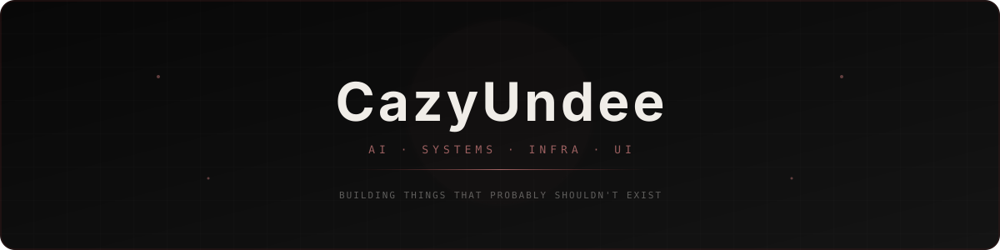

  

I build weird things.

Currently building things that probably should not be this complicated:

* **Plan0** - a completely from-scratch 64-bit OS inspired by UNIX, but taken way too far
* **Bixon** - a programming language built for humans. Very early, compiles to assembly, and currently very painful
* **CronixUI** - a UI library for building ridiculously polished interfaces, with 11 language targets across web, desktop, and mobile

I like building things from the bottom up, whether that's a model, runtime, CLI, operating system, interface, or some questionable combination of all five.

### What I work on

* Agentic development tools
* Local AI & inference
* Systems & infrastructure
* Programming languages
* UI systems
* Generally making computers do things they weren't supposed to do

### Find me elsewhere

[Personal Website](#) · [Writing](#) · [Hugging Face](https://huggingface.co/cazyundee) · [Kaggle](https://www.kaggle.com/crazybro)

---

> building things, breaking things, figuring out why they broke
